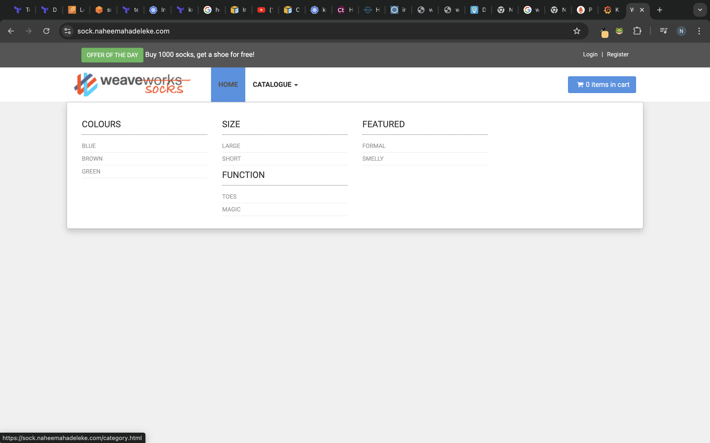

# Setup Details for sock shop

Provision the Socks Shop Example Application
The Socks Shop is a microservices-based demo application that showcases various microservices working together.

1. Terraform Configuration
   The Terraform code provisions the necessary infrastructure for deploying the microservices. This includes setting up an AWS EKS (Elastic Kubernetes Service) cluster and other dependencies.
   

2. Kubernetes Setup
   Update kubeconfig
   Update your kubeconfig to point to the EKS cluster after succesfully provisioning your infrastructure:
   `aws eks update-kubeconfig --region eu-west-2 --name sockShop`

3. Create Namespace
   Create a namespace for the microservices and set it as default:

   `kubectl create namespace sock-shop`
   `kubectl config set-context --current --namespace=sock-shop.`

4. Create your manifest files , each manifest file is an arm of the microservice and containes the deployment and the service. Make sure the frontend service has a type Loadbalancer as you will be using nginx ingress implentation for your ingress. Apply manifest using ;
   `kubectl apply -f manifest/`

5. Create your ingress yaml file
6. Apply Ingress Controller
   Apply the Ingress controller configuration:

   `kubectl apply -f https://raw.githubusercontent.com/kubernetes/ingress-nginx/controller-v1.11.1/deploy/static/provider/aws/deploy.yaml`

   

7. Install helm on your machine
8. Add Prometheus helm chart
   `helm repo add prometheus  https://prometheus-community.github.io/helm-charts`

9. Install the chart that includes grafana , alert manager, and prometheus
   `helm upgrade --install prometheus prometheus/kube-prometheus-stack`

10. Apply your ingress.yaml file using
    `kubectl apply -f manifest/Ingress.yaml`

11. Add helm repo for your certificate manager
    `helm repo add jetstack https://charts.jetstack.io --force-update`

12. Install the cert manager chart

    ```
    helm install \
    cert-manager jetstack/cert-manager \
    --namespace cert-manager \
    --create-namespace \
    --version v1.15.2 \
    --set crds.enabled=true
    ```

13. Create your Cluster-issuer.yaml file for the lets-encrypt configuration. Apply the file using
    `kubectl apply -f Cluster-issuer.yaml`
14. Reapply your ingress file to reflects the lets-encrypt configuration.

15. Go on aws to create route53 hosted zone.

16. Make your domain register points to your record.
    

17. Create a simple routing record for all the host defined in your ingress, make sure to route the traffic to the Network Loadbalancer created.

18. Test all the url defined in your ingress to ensure that it displays your frontend, grafana, prometheus and alert manager in https.
    

    

    

19. Define your github workflow. We would be creating two workflows such that changes made to the manifest file won't always trigger terraform configuration to rerun, hence the seperation of concern to have a terraform pipeline that handles any change in terraform configuration and a manifest pipeline that handles the change in manifest files all pointing to the same EKS.This way, when we push to the main branch, our manifest workflow triggers and when we push to the terraform branch, our terraform workflow trigger.

20. Test your work flow to make sure all pipelines are succesful.
    


